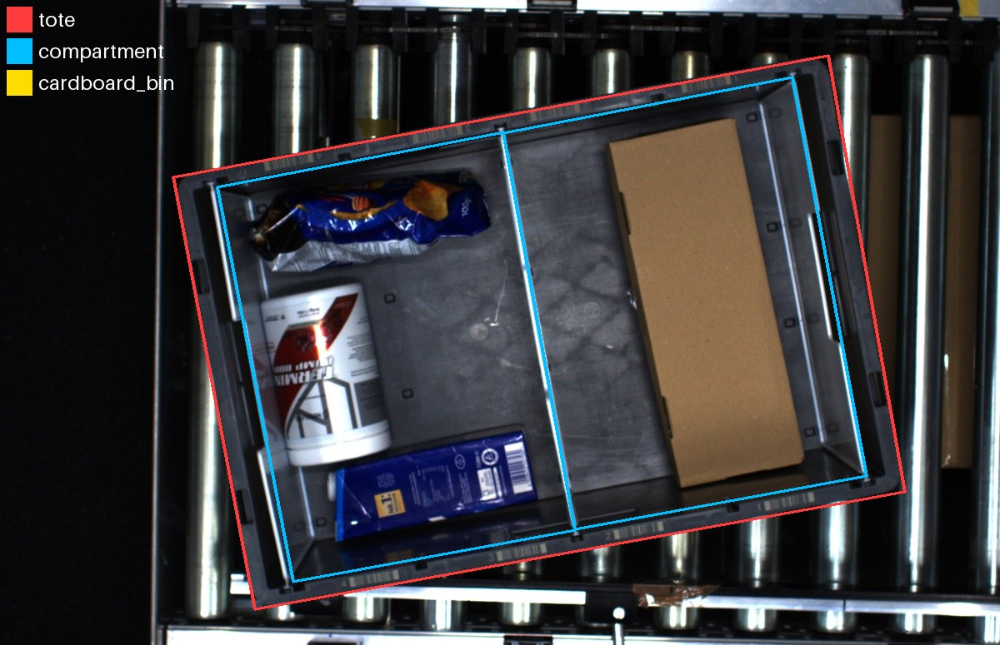
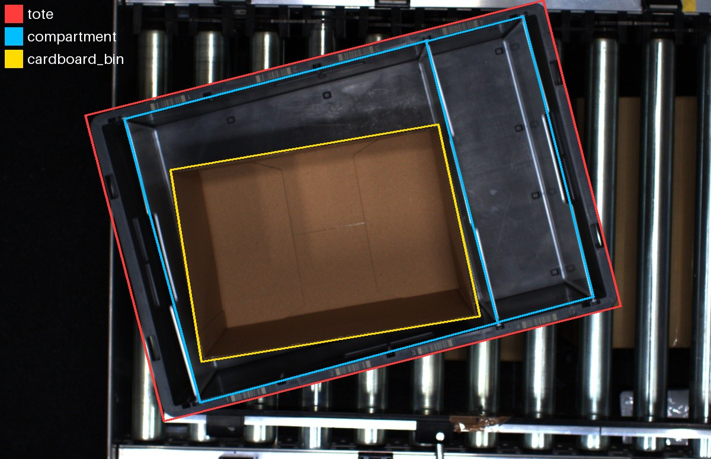
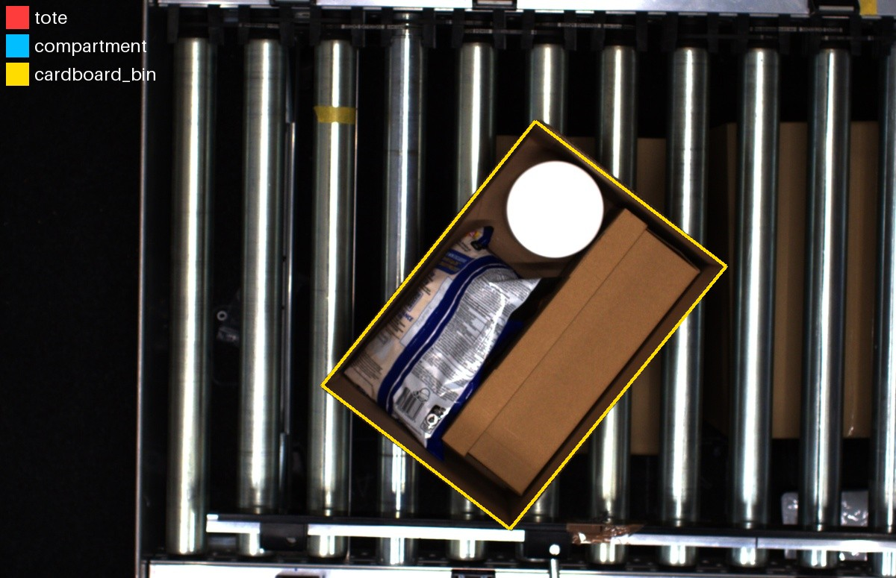

# Hiring test: tote / compartment / cardboard bin segmentation

## Requirements

Fine-tune an RF-DETR segmentation model that takes an RGB image of our picking
station and outputs instance masks for three classes:

| class | definition |
|---|---|
| `tote` | the grey plastic tote, its whole outer edge |
| `compartment` | one floor area inside the tote between the separator walls; a tote without separators has one compartment covering its whole floor |
| `cardboard_bin` | an open cardboard container that holds or can hold items (an open box or tray), inside a tote or on its own |

A cardboard bin is an open container. Other cardboard, such as a closed box,
a flat sheet or packaging, is not a cardboard bin. Products and a neighbouring
tote at the image edge are background.





Provided: `datasets/default_dataset/` with 100 images in `images/` and `_annotations.coco.json`, a
COCO file with the segmentation polygons of all relevant objects. Every
annotation carries the same category `object`; the class labels are missing.

Time: you have one hour to prepare and start the training. After that hour you
move on to the interview, and the training keeps running for at most one more
hour. When it stops, we take the best checkpoint of the run and score it on
images you have not seen, per class, by mask quality. Leave the run folder and
the `_annotations.coco.json` you trained on in this repo.

## Setup

```bash
uv sync                       # .venv with rfdetr, torch (CUDA 12.8), cvat-sdk
export GOOGLE_API_KEY=...     # the Gemini key you were given
```

The CVAT login, for the scripts and the CVAT website, is in `.env`.

## RF-DETR fine-tuning

```bash
uv run python train.py --data datasets/default_dataset --out runs/try1 --epochs 40 --max-minutes 55
```

`--data` is a folder with `_annotations.coco.json` and its images. The
categories of that file are the classes the model learns. The script splits
off a validation set, trains, and writes a weights-only checkpoint every 2
epochs, the best checkpoints, and `checkpoint_best_total.pth` when the run
ends. `--max-minutes` ends the run at the next epoch boundary.
`uv run python train.py -h` lists the options, including the batch settings;
GPU memory with the defaults (batch 2) is about 28 GB, with
`--batch-size 1 --grad-accum 16` 25 GB.

```bash
uv run python evaluate.py --checkpoint runs/try1/checkpoint_best_total.pth --data runs/try1/dataset/valid --overlays overlays/
```

Scores a checkpoint on a COCO-labelled folder: mask AP and precision / recall
per class, and optionally the predictions drawn on the images. The same script
scores the hidden images.

## Labelling platform (CVAT)

```bash
uv run python cvat_upload.py upload --data datasets/default_dataset
uv run python cvat_upload.py download --task <id>
```

`upload` creates a task with the images and every polygon as a prelabel under
its category name, plus the extra labels in `EXTRA_LABELS` at the top of the
script, and prints the links of the task and its jobs. `download` writes the
task with its images and annotations as a new dataset folder
`datasets/task_<id>/`, which `train.py --data` takes as it is.

## Gemini

`gemini_request.py` sends a prompt with any number of images to Gemini and
prints the answer. Edit the INPUT block at the top and run it, or import
`ask()` from it.
